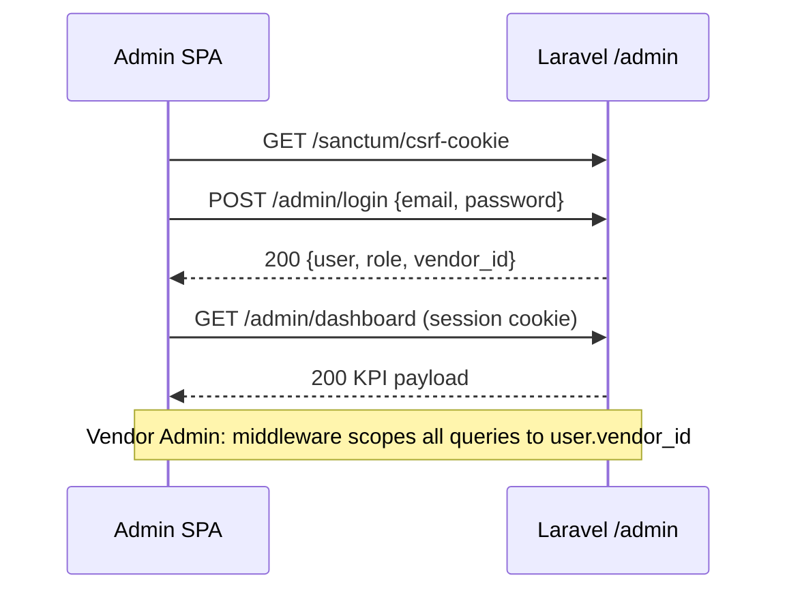
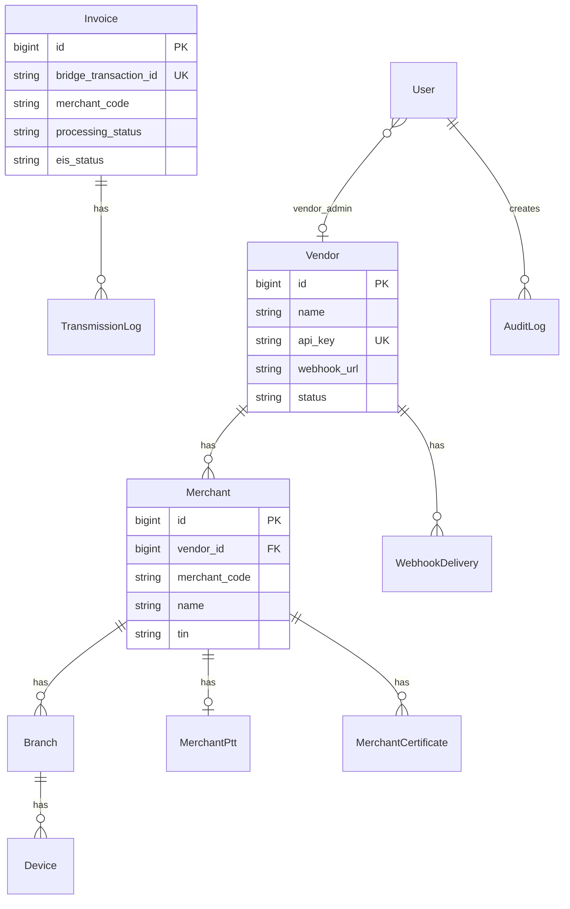
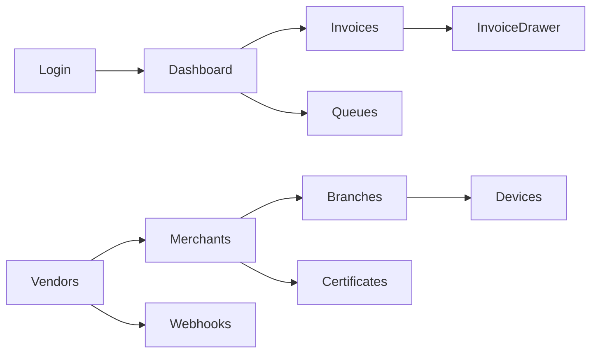

# EIS Bridge Admin Panel — Design Specification

> **Audience:** Frontend developers building the EIS Bridge Console (admin panel).  
> **Backend:** Laravel 13 app in `api/`.  
> **Status:** Reference design and architecture baseline.

---

## A. Executive summary

EIS Bridge today is a **vendor-facing JSON API** (`/v1/*`) backed by a Laravel application with a mature domain model for vendors, merchants, branches, devices, invoices, and transmission logs. Transaction ingestion (`POST /v1/transactions`), status queries, listing, and webhook configuration are implemented. Authentication for the public API is **vendor API key** (`Authorization: Bearer {api_key}`) via `ApiKeyMiddleware` — not session or token auth for humans.

The admin console and admin API routes are now present in the Laravel app and React SPA. This document remains a structural reference for route/feature mapping and phased enhancements.

The admin panel ("EIS Bridge Console") is the **command center** for platform operators: onboarding vendors, managing merchant hierarchy, monitoring invoice pipeline health, inspecting EIS transmission logs, operating queue/failed jobs, and administering certificates/PTT. The static HTML **Developer Portal** in `portal/` serves external POS integrators — it is separate from the admin console and should remain so. The admin SPA will be a new application served from Laravel via Vite (or a dedicated `admin/` Vite entry), consuming new `/admin/*` JSON endpoints protected by **Laravel Sanctum** and role-based policies.

This document maps every screen in the product spec to **real database columns** where they exist, calls out **schema gaps** explicitly, defines the **API contract** for backend work, and phases delivery so a frontend developer can start building layouts and components against mock data in Phase 1 while backend endpoints land in parallel.

---

## Merchant onboarding (Phase 3)

The six-step merchant onboarding flow (create merchant → branches → devices → certificate → PTT → readiness) is documented in [merchant-onboarding.md](./merchant-onboarding.md), including API endpoints, UI routes, and a Mermaid flow diagram.

---

## B. Stack recommendation

### Choice: **React 19 + Ant Design 5 + TanStack Query**

| Layer | Recommendation | Rationale |
|-------|----------------|-----------|
| **Framework** | React 19 | Greenfield SPA; no Vue/React precedent in repo. React + Ant Design is the strongest fit for data-dense admin UIs (tables, filters, drawers, KPI cards). |
| **Component library** | Ant Design 5 | Built-in `Table`, `Drawer`, `Form`, `Statistic`, `Timeline`, `Tabs` map directly to spec screens. Theme tokens can align with EIS Bridge palette (`--eis-blue`, `--bridge-teal` from `styles/theme.css`). |
| **Routing** | React Router 7 | Client-side routes mirror `/admin/*` paths; supports nested layouts (sidebar shell). |
| **Server state** | TanStack Query v5 | Caching, pagination, optimistic retry for job actions, stale-while-revalidate for dashboard KPIs. |
| **Client state** | Zustand (minimal) | Sidebar collapse, drawer open state, filter presets — avoid Redux for this scope. |
| **API client** | Axios | Interceptors for Sanctum CSRF cookie + bearer token; consistent error envelope handling. |
| **Build** | Vite 8 (existing) | Add second Vite entry `resources/js/admin/main.tsx`; keep vendor marketing/portal static. |
| **Auth (backend)** | Laravel Sanctum (SPA cookie) | Same-origin deployment (`APP_URL` serves Laravel + Vite assets). Simpler than Passport for first-party admin SPA. |
| **Auth (frontend)** | Cookie-based session | `GET /sanctum/csrf-cookie` → `POST /admin/login` → session cookie; `GET /admin/me` for role/vendor scope. |

### Auth flow



### Alternative considered

Vue 3 + Element Plus would work equally well technically, but React + Ant Design offers faster delivery for the table-heavy screens (Invoices, Queues, Logs) without custom component work.

---

## C. Information architecture

All routes are client-side (React Router). Laravel serves the SPA shell at `/admin` and `/admin/*` (history API fallback).

| Sidebar label | Route | Icon hint | Roles |
|---------------|-------|-----------|-------|
| Dashboard | `/admin/dashboard` | Dashboard | All |
| Vendors | `/admin/vendors` | Shop | Super Admin |
| | `/admin/vendors/:id` | — | Super Admin |
| Merchants | `/admin/merchants` | Team | Super Admin, Vendor Admin |
| | `/admin/merchants/:id` | — | Super Admin, Vendor Admin |
| Branches & Devices | `/admin/branches` | Apartment | Super Admin, Vendor Admin |
| | `/admin/branches/:id` | — | Super Admin, Vendor Admin |
| Invoices | `/admin/invoices` | FileText | All (scoped) |
| Queues & Jobs | `/admin/queues` | Cluster | Super Admin, Support/Ops |
| Certificates & PTT | `/admin/certificates` | SafetyCertificate | Super Admin, Vendor Admin |
| Webhooks | `/admin/webhooks` | Api | Super Admin, Vendor Admin |
| Logs & Audit | `/admin/logs` | Audit | Super Admin, Support/Ops |
| Settings / Users | `/admin/settings` | Setting | Super Admin |
| Login | `/admin/login` | — | Public |

**Role visibility rules:**

- **Super Admin** — all menu items.
- **Vendor Admin** — no Vendors menu; all other items scoped to own `vendor_id`.
- **Support/Operations** — Dashboard, Invoices (read), Queues (read + retry), Logs (read); no create/delete on vendors/merchants; no certificate upload.

---

## D. Screen-by-screen UI spec

### D.1 Dashboard

| | |
|---|---|
| **Route** | `/admin/dashboard` |
| **Key components** | `KpiCard` ×4, `InvoicesPerHourChart` (line), `ErrorRateChart` (area), `LatestErrorsTable`, `TopVendorsTable` |

**Data fields (existing + computed):**

| KPI / widget | Source |
|--------------|--------|
| Total invoices today | `invoices` where `created_at` = today (count) |
| Sent / acknowledged / rejected | `invoices` grouped by `processing_status` / `eis_status` |
| Queue depth | `jobs` table count where `queue` = default and `reserved_at` IS NULL |
| Invoices per hour | `invoices.created_at` truncated to hour |
| Error rate | `failed_jobs` / total processed (computed) |
| Latest errors | `failed_jobs.exception` (truncated), `failed_at` |
| Top vendors by volume | join `invoices.merchant_code` → `merchants` → `vendors` (requires merchant resolution) |

**Actions & permissions:**

| Action | Super Admin | Vendor Admin | Support/Ops |
|--------|-------------|--------------|-------------|
| View dashboard | ✓ (global) | ✓ (vendor-scoped) | ✓ (global read) |
| Drill-down to invoice | ✓ | ✓ | ✓ |

**States:**

- **Loading:** Skeleton KPI cards + chart placeholders.
- **Empty:** "No invoices yet today" with link to Merchants onboarding (Super Admin) or sandbox docs (Vendor Admin).
- **Error:** Full-width `Result` with retry; partial widget failure shows inline alert per card.

---

### D.2 Vendors

| | |
|---|---|
| **Routes** | `/admin/vendors`, `/admin/vendors/:id` |
| **Key components** | `VendorTable`, `VendorFormModal`, `ApiKeyReveal`, `WebhookConfigForm`, `MerchantSubTable`, `ActivityTimeline` |

**List columns → DB mapping:**

| UI column | Model / column | Notes |
|-----------|----------------|-------|
| Vendor name | `vendors.name` | ✓ exists |
| API key | `vendors.api_key` | Masked `VEND••••••123`; reveal on click |
| Status | `vendors.status` | **NEW** — enum: `active`, `suspended` |
| Merchants count | `vendors.merchants` count | Relationship exists |
| Created | `vendors.created_at` | ✓ exists |

**Detail fields:**

| Field | Column | Notes |
|-------|--------|-------|
| Name | `vendors.name` | Editable |
| API key | `vendors.api_key` | Regenerate action |
| Webhook URL | `vendors.webhook_url` | ✓ nullable |
| Webhook secret | `vendors.webhook_secret` | ✓ hidden; masked in UI |
| Merchants | `merchants` via `vendor_id` | Sub-table |
| Activity log | `audit_logs` | **NEW** table |

**Actions & permissions:**

| Action | Super Admin | Vendor Admin | Support/Ops |
|--------|-------------|--------------|-------------|
| List / view vendors | ✓ | ✗ | Read-only list |
| Create vendor | ✓ | ✗ | ✗ |
| Edit vendor | ✓ | ✗ | ✗ |
| Suspend / activate | ✓ | ✗ | ✗ |
| Regenerate API key | ✓ | ✗ | ✗ |
| Edit webhook | ✓ | Own vendor only (via Merchants/Webhooks) | ✗ |

**States:**

- **Empty:** "No vendors onboarded" + Create Vendor CTA.
- **Loading:** Table skeleton rows.
- **Error:** Toast on mutation failure; inline field errors on form.

---

### D.3 Merchants

| | |
|---|---|
| **Routes** | `/admin/merchants`, `/admin/merchants/:id` |
| **Key components** | `MerchantTable`, `MerchantFormModal`, `CertificateUpload`, `PttForm`, `BranchSubTable`, `InvoiceSummaryCard` |

**List columns → DB mapping:**

| UI column | Model / column | Notes |
|-----------|----------------|-------|
| Merchant name | `merchants.name` | ✓ exists |
| Merchant code | `merchants.merchant_code` | ✓ exists |
| TIN | `merchants.tin` | **NEW** |
| Vendor | `merchants.vendor.name` | via `vendor_id` |
| Branches count | `merchants.branches` count | ✓ relationship |
| Status | `merchants.status` | **NEW** — `active`, `inactive` |

**Detail fields:**

| Field | Column | Notes |
|-------|--------|-------|
| Profile | `name`, `merchant_code` | ✓ |
| TIN | `merchants.tin` | **NEW** |
| Address | `merchants.address` | **NEW** |
| Vendor | `vendor_id` | ✓ FK |
| PTT | `merchant_ptt` record | **NEW** table |
| Certificates | `merchant_certificates` | **NEW** table |
| Branches | `branches` | ✓ |
| Invoice summary | aggregate on `invoices.merchant_code` | ✓ |

**Actions & permissions:**

| Action | Super Admin | Vendor Admin | Support/Ops |
|--------|-------------|--------------|-------------|
| List / view | ✓ | Own vendor | Read-only |
| Create merchant | ✓ | ✓ (own vendor) | ✗ |
| Edit profile | ✓ | ✓ (own) | ✗ |
| Assign vendor | ✓ | ✗ | ✗ |
| Upload certificate | ✓ | ✓ (own) | ✗ |
| Set PTT | ✓ | ✓ (own) | ✗ |

**States:**

- **Empty:** "No merchants for this vendor."
- **Loading:** Table + detail skeleton.
- **Error:** Certificate upload shows virus/format validation errors.

---

### D.4 Branches & Devices

| | |
|---|---|
| **Routes** | `/admin/branches`, `/admin/branches/:id` |
| **Key components** | `BranchTable`, `BranchFormModal`, `DeviceTable`, `DeviceFormModal`, `LockToggle` |

**Branch list columns:**

| UI column | Column | Notes |
|-----------|--------|-------|
| Name | `branches.name` | ✓ |
| Code | `branches.branch_code` | ✓ |
| Merchant | `branches.merchant.name` | via `merchant_id` |
| Devices count | `branches.devices` count | ✓ |
| Status | `branches.status` | **NEW** — `active`, `inactive` |

**Branch detail:**

| Field | Column | Notes |
|-------|--------|-------|
| Address | `branches.address` | **NEW** |
| Branch code | `branches.branch_code` | ✓ |
| Merchant | `merchant_id` | ✓ |

**Device table (on branch detail):**

| Column | Column | Notes |
|--------|--------|-------|
| POS device ID | `devices.pos_device_id` | ✓ |
| Name | `devices.name` | ✓ |
| Status | `devices.status` | **NEW** — `active`, `locked` |
| Created | `devices.created_at` | ✓ |

**Actions & permissions:**

| Action | Super Admin | Vendor Admin | Support/Ops |
|--------|-------------|--------------|-------------|
| List / view | ✓ | Scoped | Read-only |
| Add branch | ✓ | ✓ | ✗ |
| Add device | ✓ | ✓ | ✗ |
| Lock / unlock device | ✓ | ✓ | ✓ (lock only) |
| Delete branch/device | ✓ | ✓ | ✗ |

**States:**

- **Empty branch list:** CTA to create first branch from merchant detail.
- **Empty devices:** "No POS devices registered."
- **Locked device:** Badge + tooltip; invoice submission from API should reject locked devices (backend rule, Phase 2).

---

### D.5 Invoices

| | |
|---|---|
| **Route** | `/admin/invoices` (detail via right `Drawer`) |
| **Key components** | `InvoiceFilterBar`, `InvoiceTable`, `InvoiceDetailDrawer`, `JsonViewer`, `TransmissionLogTimeline`, `RetryButton` |

**Filter bar:**

| Filter | Maps to |
|--------|---------|
| Date range | `invoices.created_at` (`from`, `to`) |
| Vendor | via `merchant_code` → `merchants.vendor_id` |
| Merchant | `invoices.merchant_code` |
| Branch | `invoices.branch_code` |
| Status | `invoices.processing_status` |

**Table columns → `invoices` table:**

| Column | Attribute |
|--------|-----------|
| Bridge transaction ID | `bridge_transaction_id` |
| POS transaction ID | `transaction_id` |
| Merchant | `merchant_code` |
| Branch | `branch_code` |
| Device | `pos_device_id` |
| Processing status | `processing_status` (default `queued`) |
| EIS status | `eis_status` (nullable) |
| EIS reference no. | `eis_reference_no` (nullable) |
| Created | `created_at` |

**Detail drawer tabs:**

| Tab | Content |
|-----|---------|
| Overview | Status badges, IDs, timestamps |
| Raw POS JSON | `raw_pos_json` (JSON viewer) |
| BIR JSON | `bir_json` (nullable) |
| Signed JSON | `signed_json` (masked fields) |
| Transmission logs | `transmission_logs`: `event`, `timestamp`, `metadata` |

**Known `processing_status` values (from API docs):** `queued`, `sent`, `rejected`  
**Known `eis_status` values:** `acknowledged` (and null while pending)

**Known `transmission_logs.event` values (from codebase):** `queued`, `sent_to_eis` (extend: `eis_acknowledged`, `failed`)

**Actions & permissions:**

| Action | Super Admin | Vendor Admin | Support/Ops |
|--------|-------------|--------------|-------------|
| List / view / export | ✓ | Scoped to vendor merchants | ✓ |
| Retry failed invoice | ✓ | ✗ | ✓ |
| View signed JSON | ✓ (full) | ✓ (masked) | ✓ (masked) |

**States:**

- **Empty:** "No invoices match filters" with clear-filters link.
- **Loading:** Table skeleton; drawer shows spinner on row click.
- **Error:** 404 drawer state if invoice deleted mid-session.

---

### D.6 Queues & Jobs

| | |
|---|---|
| **Route** | `/admin/queues` |
| **Key components** | `QueueStatsCards`, `PendingJobsTable`, `FailedJobsTable`, `RetryConfirmModal` |

**Data sources (Laravel queue tables — already migrated):**

| Widget / column | Table.column |
|-----------------|--------------|
| Pending count | `jobs` (count) |
| Failed count | `failed_jobs` (count) |
| Job ID | `failed_jobs.id` |
| UUID | `failed_jobs.uuid` |
| Queue | `failed_jobs.queue` |
| Connection | `failed_jobs.connection` |
| Payload | `failed_jobs.payload` (parse `displayName` / job class) |
| Exception | `failed_jobs.exception` (first line) |
| Failed at | `failed_jobs.failed_at` |
| Attempts | `jobs.attempts` (pending tab) |

**Invoice linkage:** Parse job payload for `invoice_id` or `bridge_transaction_id` (convention to be established when queue jobs are implemented — currently `TransactionProcessor` is synchronous).

**Actions & permissions:**

| Action | Super Admin | Vendor Admin | Support/Ops |
|--------|-------------|--------------|-------------|
| View queue stats | ✓ | ✗ | ✓ |
| Retry failed job | ✓ | ✗ | ✓ |
| Delete failed job | ✓ | ✗ | ✗ |
| Flush queue | ✓ | ✗ | ✗ |

**States:**

- **Empty failed:** "No failed jobs — pipeline healthy."
- **Error on retry:** Show exception message from API response.

---

### D.7 Certificates & PTT

| | |
|---|---|
| **Routes** | `/admin/certificates`, `/admin/certificates/:merchantId` |
| **Key components** | `CertificateTable`, `CertExpiryAlert`, `CertificateUploadForm`, `PttDetailForm` |

**Requires new tables** (see Section F). Proposed schema:

**`merchant_certificates`:** `id`, `merchant_id`, `filename`, `storage_path`, `encrypted_password`, `expires_at`, `uploaded_by`, `timestamps`

**`merchant_ptt`:** `id`, `merchant_id`, `ptt_number`, `valid_from`, `valid_to`, `status`, `timestamps`

**List columns:**

| Column | Source |
|--------|--------|
| Merchant | `merchants.name` + `merchant_code` |
| Cert expiry | `merchant_certificates.expires_at` |
| PTT status | `merchant_ptt.status` |
| PTT number | `merchant_ptt.ptt_number` |

**Warnings banner:**

- Expiring within 30 days (`expires_at`)
- Missing certificate or PTT record

**Actions & permissions:**

| Action | Super Admin | Vendor Admin | Support/Ops |
|--------|-------------|--------------|-------------|
| List | ✓ | Scoped | Read-only |
| Upload / replace cert | ✓ | ✓ (own) | ✗ |
| Set PTT | ✓ | ✓ (own) | ✗ |

---

### D.8 Webhooks

| | |
|---|---|
| **Route** | `/admin/webhooks` (vendor-scoped tab or filter) |
| **Key components** | `WebhookConfigCard`, `WebhookTestButton`, `WebhookDeliveryTable` |

**Existing fields (`vendors`):**

| Field | Column |
|-------|--------|
| Webhook URL | `webhook_url` |
| Secret | `webhook_secret` |

**New table `webhook_deliveries`:** `id`, `vendor_id`, `invoice_id` (nullable), `event`, `request_url`, `response_code`, `response_body` (truncated), `delivered_at`, `success`, `timestamps`

**Actions & permissions:**

| Action | Super Admin | Vendor Admin | Support/Ops |
|--------|-------------|--------------|-------------|
| View config | ✓ | Own vendor | Read-only |
| Edit URL/secret | ✓ | Own vendor | ✗ |
| Send test ping | ✓ | Own vendor | ✓ |
| View delivery logs | ✓ | Own vendor | ✓ |

**States:**

- **No webhook configured:** Prompt to set URL (links to vendor/merchant context).
- **Delivery failures:** Highlight rows where `success = false`.

---

### D.9 Logs & Audit

| | |
|---|---|
| **Route** | `/admin/logs` with tabs: System, Audit |
| **Key components** | `SystemLogTable`, `AuditLogTable`, `LogLevelFilter` |

**System logs:** Read Laravel log channel (via API parsing `storage/logs/laravel.log` or future `system_logs` table). Phase 1 can use `pail` / file tail endpoint; Phase 2 persists searchable logs.

**Audit logs (NEW `audit_logs`):** `id`, `user_id`, `action`, `auditable_type`, `auditable_id`, `old_values` (json), `new_values` (json), `ip_address`, `created_at`

**Actions & permissions:**

| Action | Super Admin | Vendor Admin | Support/Ops |
|--------|-------------|--------------|-------------|
| View system logs | ✓ | ✗ | ✓ |
| View audit logs | ✓ | Own vendor scope | Read-only global |

---

### D.10 Settings / Users

| | |
|---|---|
| **Route** | `/admin/settings` (tabs: Users, Profile, Platform) |
| **Key components** | `UserTable`, `UserFormModal`, `RoleSelect`, `ProfileForm` |

**User fields (existing + new):**

| Field | Column | Notes |
|-------|--------|-------|
| Name | `users.name` | ✓ |
| Email | `users.email` | ✓ |
| Role | `users.role` | **NEW** — `super_admin`, `vendor_admin`, `support` |
| Vendor | `users.vendor_id` | **NEW** nullable FK → `vendors` |
| Last login | `users.last_login_at` | **NEW** optional |

**Actions:** Super Admin only — create/edit/deactivate users, assign roles.

---

## E. API contract

### E.1 Route registration (proposed)

Add `routes/admin.php` registered in `bootstrap/app.php`:

```php
// bootstrap/app.php — inside withRouting or ->then()
Route::middleware(['web', 'auth:sanctum'])
    ->prefix('admin')
    ->group(base_path('routes/admin.php'));
```

Public auth routes (no `auth:sanctum`):

```php
Route::prefix('admin')->group(function () {
    Route::post('/login', [Admin\AuthController::class, 'login']);
    Route::post('/logout', [Admin\AuthController::class, 'logout'])->middleware('auth:sanctum');
    Route::get('/me', [Admin\AuthController::class, 'me'])->middleware('auth:sanctum');
});
```

All responses use JSON. Error envelope (consistent with vendor API):

```json
{
  "error": "forbidden",
  "message": "You do not have permission to perform this action."
}
```

Paginated list envelope (Laravel default):

```json
{
  "data": [],
  "current_page": 1,
  "per_page": 25,
  "total": 142
}
```

### E.2 Endpoint map

| Method | Endpoint | Status | Controller (proposed) | Notes |
|--------|----------|--------|----------------------|-------|
| POST | `/admin/login` | **NEW** | `Admin\AuthController@login` | Returns user + role |
| POST | `/admin/logout` | **NEW** | `Admin\AuthController@logout` | |
| GET | `/admin/me` | **NEW** | `Admin\AuthController@me` | |
| GET | `/admin/dashboard` | **NEW** | `Admin\DashboardController@index` | KPIs + chart series |
| GET | `/admin/vendors` | **NEW** | `Admin\VendorController@index` | |
| POST | `/admin/vendors` | **NEW** | `Admin\VendorController@store` | |
| GET | `/admin/vendors/{id}` | **NEW** | `Admin\VendorController@show` | |
| PATCH | `/admin/vendors/{id}` | **NEW** | `Admin\VendorController@update` | |
| POST | `/admin/vendors/{id}/regenerate-key` | **NEW** | `Admin\VendorController@regenerateKey` | |
| POST | `/admin/vendors/{id}/suspend` | **NEW** | `Admin\VendorController@suspend` | |
| GET | `/admin/merchants` | **NEW** | `Admin\MerchantController@index` | |
| POST | `/admin/merchants` | **NEW** | `Admin\MerchantController@store` | |
| GET | `/admin/merchants/{id}` | **NEW** | `Admin\MerchantController@show` | |
| PATCH | `/admin/merchants/{id}` | **NEW** | `Admin\MerchantController@update` | |
| POST | `/admin/merchants/{id}/certificate` | **NEW** | `Admin\CertificateController@store` | Multipart `.pfx`/`.pem` |
| PUT | `/admin/merchants/{id}/ptt` | **NEW** | `Admin\PttController@upsert` | |
| GET | `/admin/branches` | **NEW** | `Admin\BranchController@index` | |
| POST | `/admin/branches` | **NEW** | `Admin\BranchController@store` | |
| GET | `/admin/branches/{id}` | **NEW** | `Admin\BranchController@show` | |
| PATCH | `/admin/branches/{id}` | **NEW** | `Admin\BranchController@update` | |
| POST | `/admin/branches/{id}/devices` | **NEW** | `Admin\DeviceController@store` | |
| PATCH | `/admin/devices/{id}` | **NEW** | `Admin\DeviceController@update` | Lock/unlock |
| GET | `/admin/invoices` | **NEW** | `Admin\InvoiceController@index` | Vendor-scoped filters |
| GET | `/admin/invoices/{id}` | **NEW** | `Admin\InvoiceController@show` | Includes `transmission_logs` |
| POST | `/admin/invoices/{id}/retry` | **NEW** | `Admin\InvoiceController@retry` | Re-queue processing |
| GET | `/admin/queues` | **NEW** | `Admin\QueueController@index` | Pending + failed counts |
| GET | `/admin/jobs/failed` | **NEW** | `Admin\QueueController@failed` | Paginated `failed_jobs` |
| POST | `/admin/jobs/{id}/retry` | **NEW** | `Admin\QueueController@retry` | `artisan queue:retry` wrapper |
| DELETE | `/admin/jobs/{id}` | **NEW** | `Admin\QueueController@destroy` | |
| GET | `/admin/certificates` | **NEW** | `Admin\CertificateController@index` | |
| GET | `/admin/webhooks` | **NEW** | `Admin\WebhookController@index` | Per vendor |
| PATCH | `/admin/webhooks/{vendorId}` | **NEW** | `Admin\WebhookController@update` | |
| POST | `/admin/webhooks/{vendorId}/test` | **NEW** | `Admin\WebhookController@test` | |
| GET | `/admin/webhooks/{vendorId}/deliveries` | **NEW** | `Admin\WebhookController@deliveries` | |
| GET | `/admin/logs/system` | **NEW** | `Admin\LogController@system` | |
| GET | `/admin/logs/audit` | **NEW** | `Admin\LogController@audit` | |
| GET | `/admin/users` | **NEW** | `Admin\UserController@index` | |
| POST | `/admin/users` | **NEW** | `Admin\UserController@store` | |
| PATCH | `/admin/users/{id}` | **NEW** | `Admin\UserController@update` | |
| — | `GET /v1/transactions` | **EXISTS** | `TransactionController@index` | Vendor API key auth; not admin |
| — | `GET /v1/transactions/{bridgeTransactionId}` | **EXISTS** | `TransactionController@show` | |
| — | `POST /v1/vendors/webhook` | **EXISTS** | `WebhookController@configure` | Vendor self-service; admin overrides via `/admin/webhooks` |

### E.3 Request/response examples

#### POST `/admin/login`

```json
// Request
{ "email": "admin@eisbridge.ph", "password": "••••••••" }

// Response 200
{
  "user": {
    "id": 1,
    "name": "Platform Admin",
    "email": "admin@eisbridge.ph",
    "role": "super_admin",
    "vendor_id": null
  }
}
```

#### GET `/admin/vendors`

```json
// Response 200
{
  "data": [
    {
      "id": 1,
      "name": "Sandbox Vendor",
      "api_key_masked": "VEND••••••123",
      "status": "active",
      "merchants_count": 3,
      "webhook_url": "https://example.com/hook",
      "created_at": "2026-02-02T10:00:00+08:00"
    }
  ],
  "current_page": 1,
  "per_page": 25,
  "total": 1
}
```

#### POST `/admin/vendors`

```json
// Request
{ "name": "Acme POS Inc.", "webhook_url": null }

// Response 201
{
  "id": 2,
  "name": "Acme POS Inc.",
  "api_key": "VENDOR_API_KEY_abc123",
  "status": "active",
  "created_at": "2026-06-08T09:00:00+08:00"
}
```

#### GET `/admin/merchants`

```json
// Response 200
{
  "data": [
    {
      "id": 1,
      "vendor_id": 1,
      "vendor_name": "Sandbox Vendor",
      "merchant_code": "MRC123",
      "name": "Sandbox Merchant",
      "tin": null,
      "address": null,
      "status": "active",
      "branches_count": 1,
      "created_at": "2026-02-02T10:00:00+08:00"
    }
  ],
  "current_page": 1,
  "per_page": 25,
  "total": 1
}
```

#### GET `/admin/invoices?merchant_code=MRC123&status=queued&from=2026-06-08T00:00:00+08:00`

```json
{
  "data": [
    {
      "id": 42,
      "bridge_transaction_id": "EB-20260608-000042",
      "transaction_id": "POS-10001",
      "merchant_code": "MRC123",
      "branch_code": "BR001",
      "pos_device_id": "POS01",
      "processing_status": "queued",
      "eis_status": null,
      "eis_reference_no": null,
      "created_at": "2026-06-08T14:23:55+08:00",
      "updated_at": "2026-06-08T14:23:55+08:00"
    }
  ],
  "current_page": 1,
  "per_page": 50,
  "total": 1
}
```

#### GET `/admin/invoices/42`

```json
{
  "id": 42,
  "bridge_transaction_id": "EB-20260608-000042",
  "transaction_id": "POS-10001",
  "merchant_code": "MRC123",
  "branch_code": "BR001",
  "pos_device_id": "POS01",
  "processing_status": "queued",
  "eis_status": null,
  "eis_reference_no": null,
  "raw_pos_json": { "transaction_id": "POS-10001", "totals": { "net": 224.0 } },
  "bir_json": null,
  "signed_json": null,
  "transmission_logs": [
    {
      "id": 1,
      "event": "queued",
      "timestamp": "2026-06-08T14:23:55+08:00",
      "metadata": null
    }
  ],
  "created_at": "2026-06-08T14:23:55+08:00",
  "updated_at": "2026-06-08T14:23:55+08:00"
}
```

#### GET `/admin/queues`

```json
{
  "pending_count": 12,
  "failed_count": 2,
  "queues": [
    { "name": "default", "pending": 12, "failed": 2 }
  ]
}
```

#### POST `/admin/jobs/5/retry`

```json
// Response 200
{ "status": "success", "message": "Job queued for retry.", "job_id": 5 }
```

#### POST `/admin/merchants/1/certificate`

```
Content-Type: multipart/form-data

file: certificate.pfx
password: secret
expires_at: 2027-06-08
```

```json
// Response 201
{
  "id": 1,
  "merchant_id": 1,
  "filename": "certificate.pfx",
  "expires_at": "2027-06-08T00:00:00+08:00",
  "uploaded_at": "2026-06-08T10:00:00+08:00"
}
```

### E.4 Middleware & policies

**Middleware (register in `bootstrap/app.php`):**

| Alias | Class | Purpose |
|-------|-------|---------|
| `admin` | `AdminMiddleware` | User has any admin role |
| `role:super_admin` | `RoleMiddleware` | Super Admin only |
| `role:support` | `RoleMiddleware` | Support/Ops + Super Admin |

**`AdminMiddleware` logic:**

1. Require `auth:sanctum` session.
2. Require `users.role` in (`super_admin`, `vendor_admin`, `support`).
3. Attach `admin_vendor_id` to request when `role = vendor_admin`.

**Eloquent policies (app/Policies/):**

| Policy | Model | Rules |
|--------|-------|-------|
| `VendorPolicy` | `Vendor` | viewAny/create/update: super_admin; view: super_admin, support |
| `MerchantPolicy` | `Merchant` | vendor_admin: `merchant.vendor_id === user.vendor_id` |
| `BranchPolicy` | `Branch` | via merchant.vendor_id chain |
| `DevicePolicy` | `Device` | via branch.merchant.vendor_id; lock: support + admins |
| `InvoicePolicy` | `Invoice` | vendor_admin: merchant_code in vendor's merchants; support: read + retry |
| `UserPolicy` | `User` | super_admin only |

**Vendor scoping trait** (`ScopesByVendor`): apply global scope on Merchant, Branch, Device, Invoice queries when `auth()->user()->role === 'vendor_admin'`.

---

## F. Data model reference

### F.1 Existing models (implemented)

| Model | Table | Key columns | Relationships | Admin screens |
|-------|-------|-------------|---------------|---------------|
| `Vendor` | `vendors` | `id`, `name`, `api_key`, `webhook_url`, `webhook_secret`, `created_at`, `updated_at` | hasMany `Merchant` | Vendors, Webhooks, Dashboard |
| `Merchant` | `merchants` | `id`, `vendor_id`, `merchant_code`, `name`, `created_at`, `updated_at` | belongsTo `Vendor`; hasMany `Branch` | Merchants, Certificates, Invoices |
| `Branch` | `branches` | `id`, `merchant_id`, `branch_code`, `name`, `created_at`, `updated_at` | belongsTo `Merchant`; hasMany `Device` | Branches & Devices |
| `Device` | `devices` | `id`, `branch_id`, `pos_device_id`, `name`, `created_at`, `updated_at` | belongsTo `Branch` | Branches & Devices |
| `Invoice` | `invoices` | `id`, `bridge_transaction_id`, `transaction_id`, `merchant_code`, `branch_code`, `pos_device_id`, `raw_pos_json`, `bir_json`, `signed_json`, `processing_status`, `eis_status`, `eis_reference_no`, `created_at`, `updated_at` | hasMany `TransmissionLog` | Invoices, Dashboard |
| `TransmissionLog` | `transmission_logs` | `id`, `invoice_id`, `event`, `timestamp`, `metadata`, `created_at`, `updated_at` | belongsTo `Invoice` | Invoices (drawer), Logs |
| `User` | `users` | `id`, `name`, `email`, `password`, `email_verified_at`, `created_at`, `updated_at` | — | Settings/Users |

### F.2 Queue infrastructure tables (Laravel built-in)

| Table | Admin screens |
|-------|---------------|
| `jobs` | Queues & Jobs |
| `failed_jobs` | Queues & Jobs, Dashboard errors |
| `job_batches` | Queues & Jobs (Phase 2) |

### F.3 Schema gaps (migrations needed)

| Table / change | Proposed columns | Screens unblocked |
|----------------|------------------|-------------------|
| `vendors.status` | `string`, default `active` | Vendors list, suspend action |
| `merchants.tin` | `string`, nullable | Merchants |
| `merchants.address` | `text`, nullable | Merchants |
| `merchants.status` | `string`, default `active` | Merchants |
| `branches.address` | `text`, nullable | Branches |
| `branches.status` | `string`, default `active` | Branches |
| `devices.status` | `string`, default `active` | Devices lock/unlock |
| `users.role` | `string` | Auth, all policies |
| `users.vendor_id` | `foreignId`, nullable | Vendor Admin scoping |
| `merchant_certificates` | see D.7 | Certificates & PTT |
| `merchant_ptt` | see D.7 | Certificates & PTT |
| `webhook_deliveries` | see D.8 | Webhooks |
| `audit_logs` | see D.9 | Logs & Audit |

### F.4 Entity relationship diagram



---

## G. Frontend folder structure

> **Status:** Scaffolded (2026-06-08) — JSX stubs wired to React Router; backend `/admin` API not yet implemented.

```
api/
├── resources/
│   ├── css/
│   │   └── admin.css                    # Admin SPA base styles
│   ├── js/
│   │   └── admin/
│   │       ├── main.jsx                 # Vite entry: QueryClient, Ant Design theme, Router
│   │       ├── App.jsx                  # Route definitions (basename /admin)
│   │       ├── layouts/
│   │       │   ├── AdminLayout.jsx      # Ant Design Layout: Sidebar + Topbar + Outlet
│   │       │   └── AuthLayout.jsx       # Login shell
│   │       ├── components/
│   │       │   ├── Sidebar.jsx
│   │       │   ├── Topbar.jsx
│   │       │   ├── DataTable.jsx        # Ant Table wrapper
│   │       │   ├── StatusBadge.jsx      # Ant Tag wrapper
│   │       │   ├── JsonViewer.jsx
│   │       │   ├── Pagination.jsx
│   │       │   ├── Modal.jsx
│   │       │   └── FormField.jsx
│   │       ├── pages/
│   │       │   ├── LoginPage.jsx
│   │       │   ├── Dashboard/
│   │       │   │   └── DashboardPage.jsx
│   │       │   ├── Vendors/
│   │       │   │   ├── VendorList.jsx
│   │       │   │   ├── VendorCreate.jsx
│   │       │   │   ├── VendorDetail.jsx
│   │       │   │   └── VendorWebhookConfig.jsx
│   │       │   ├── Merchants/
│   │       │   │   ├── MerchantList.jsx
│   │       │   │   ├── MerchantCreate.jsx
│   │       │   │   ├── MerchantDetail.jsx
│   │       │   │   └── MerchantCertificate.jsx
│   │       │   ├── Branches/
│   │       │   │   ├── BranchList.jsx
│   │       │   │   ├── BranchDetail.jsx
│   │       │   │   └── DeviceList.jsx
│   │       │   ├── Invoices/
│   │       │   │   ├── InvoiceList.jsx
│   │       │   │   ├── InvoiceDetail.jsx
│   │       │   │   └── InvoiceRetryModal.jsx
│   │       │   ├── Queues/
│   │       │   │   ├── QueuesPage.jsx   # Composes QueueStatus + FailedJobs
│   │       │   │   ├── QueueStatus.jsx
│   │       │   │   └── FailedJobs.jsx
│   │       │   ├── Certificates/
│   │       │   │   ├── CertificateList.jsx
│   │       │   │   └── CertificateUpload.jsx
│   │       │   ├── Webhooks/
│   │       │   │   └── WebhooksPage.jsx
│   │       │   ├── Logs/
│   │       │   │   ├── LogsPage.jsx     # Tabs: System + Audit
│   │       │   │   ├── SystemLogs.jsx
│   │       │   │   └── AuditLogs.jsx
│   │       │   └── Settings/
│   │       │       ├── SettingsPage.jsx # Tabs: Users + Roles
│   │       │       ├── UserList.jsx
│   │       │       └── RoleManagement.jsx
│   │       ├── hooks/
│   │       │   ├── useAuth.js           # Reads Zustand authStore
│   │       │   ├── useFetch.js          # TanStack Query wrapper
│   │       │   └── usePagination.js
│   │       ├── services/
│   │       │   ├── api.js               # Axios instance → baseURL /admin
│   │       │   ├── vendorService.js
│   │       │   ├── merchantService.js
│   │       │   ├── invoiceService.js
│   │       │   └── queueService.js
│   │       └── store/
│   │           ├── authStore.js         # Zustand
│   │           ├── uiStore.js
│   │           └── vendorStore.js
│   └── views/
│       └── admin.blade.php              # SPA mount: <div id="admin-root">
├── routes/
│   ├── web.php                          # Catch-all SPA shell (see below)
│   └── admin.php                        # NEW backend API routes (not yet created)
└── vite.config.js                       # Entries: app.js + admin/main.jsx
```

**Vite entries** (`vite.config.js`):

- `resources/css/app.css` + `resources/js/app.js` — existing Laravel welcome
- `resources/css/admin.css` + `resources/js/admin/main.jsx` — admin SPA

**Laravel view route** (implemented in `routes/web.php`):

```php
Route::view('/admin/{any?}', 'admin')->where('any', '.*');
```

**Dev workflow:** From `api/`, run `npm run dev` alongside `php artisan serve`. Visit `http://localhost:8000/admin` (or your Laragon URL + `/admin`).

---

## H. Implementation phases

### Phase 1 — MVP (4–6 weeks)

**Goal:** Operable console for daily monitoring and basic CRUD.

| Area | Scope |
|------|-------|
| **Backend** | Sanctum auth; `users.role` + `vendor_id` migration; `routes/admin.php`; CRUD for vendors, merchants, branches, devices; invoice list/detail (read-only); dashboard KPIs; basic policies |
| **Frontend** | Login, AdminLayout, Dashboard, Vendors, Merchants, Branches, Invoices (table + drawer), Settings/Users (super admin) |
| **Schema** | `users.role`, `users.vendor_id`, `vendors.status`, `devices.status` |
| **Out of scope** | Certificates upload, PTT, webhook delivery log, async queue processing |

**Exit criteria:** Super Admin can onboard a vendor → merchant → branch → device and view invoices created via sandbox API.

### Phase 2 — Operations (3–4 weeks)

| Area | Scope |
|------|-------|
| **Backend** | Queue dashboard (`jobs`, `failed_jobs`); retry/delete; invoice retry; `audit_logs`; webhook delivery tracking; merchant cert + PTT tables |
| **Frontend** | Queues & Jobs, Certificates & PTT, Webhooks, Logs & Audit |
| **Processing** | Dispatch `ProcessInvoiceJob` from `TransactionProcessor` (currently synchronous) |

**Exit criteria:** Support can retry failed jobs and invoices; Vendor Admin can upload certificate; expiring cert warnings visible.

### Phase 3 — Hardening & analytics (2–3 weeks)

| Area | Scope |
|------|-------|
| **Backend** | Full audit on all mutations; device lock enforcement in API; webhook test ping; export CSV on invoices; rate limiting |
| **Frontend** | Charts (invoices/hour, error rate); advanced filters; masked signed JSON by role; responsive mobile sidebar |
| **Ops** | Alerting hooks for queue depth / cert expiry (email or webhook) |

---

## I. Wireframe notes

### I.1 Dashboard layout

```
┌──────────────────────────────────────────────────────────────────────────┐
│ [EIS Bridge Console]                              Admin ▾   🔔   ⚙      │
├────────────┬─────────────────────────────────────────────────────────────┤
│ Dashboard  │  Dashboard                                                  │
│ Vendors    │  ┌──────────┐ ┌──────────┐ ┌──────────┐ ┌──────────┐       │
│ Merchants  │  │ Invoices │ │ Sent     │ │ Ack'd    │ │ Queue    │       │
│ Branches   │  │ Today 847│ │ 612      │ │ 580      │ │ Depth 12 │       │
│ Invoices   │  └──────────┘ └──────────┘ └──────────┘ └──────────┘       │
│ Queues     │  ┌────────────────────────────┐ ┌─────────────────────┐    │
│ Certs      │  │ Invoices per hour (chart)  │ │ Error rate (chart)  │    │
│ Webhooks   │  └────────────────────────────┘ └─────────────────────┘    │
│ Logs       │  ┌────────────────────────────┐ ┌─────────────────────┐    │
│ Settings   │  │ Latest errors (table)      │ │ Top vendors (table) │    │
│            │  └────────────────────────────┘ └─────────────────────┘    │
└────────────┴─────────────────────────────────────────────────────────────┘
```

### I.2 List + detail pattern (Vendors, Merchants, Branches)

```
┌─────────────────────────────────────────────────────────────────────────┐
│ Merchants                                    [+ Create Merchant]        │
├─────────────────────────────────────────────────────────────────────────┤
│ 🔍 Search   Vendor ▾   Status ▾                          Page 1 of 5   │
├─────────────────────────────────────────────────────────────────────────┤
│ Name          │ Code    │ TIN           │ Vendor      │ Branches │ ▸  │
│ Sandbox Merc  │ MRC123  │ —             │ Sandbox Ven │ 1        │ ▸  │
│ Retail Co     │ MRC456  │ 123-456-789   │ Acme POS    │ 4        │ ▸  │
└─────────────────────────────────────────────────────────────────────────┘

Row click OR ▸ navigates to:

┌─────────────────────────────────────────────────────────────────────────┐
│ ← Merchants / Sandbox Merchant                                          │
├─────────────────────────────────────────────────────────────────────────┤
│ [Profile] [PTT & Certificates] [Branches] [Invoices]                  │
│                                                                         │
│  Merchant code: MRC123          Vendor: Sandbox Vendor                  │
│  TIN: —                         Status: ● Active                      │
│  Address: —                                                             │
│                                                                         │
│  Branches (1)                                    [+ Add Branch]         │
│  ┌───────────────────────────────────────────────────────────────────┐  │
│  │ BR001  Main Branch   1 device   Active                            │  │
│  └───────────────────────────────────────────────────────────────────┘  │
└─────────────────────────────────────────────────────────────────────────┘
```

### I.3 Invoice detail drawer

```
                                    ┌─────────────────────────────────────┐
                                    │ Invoice EB-20260608-000042      [×] │
                                    ├─────────────────────────────────────┤
                                    │ POS-10001          ● queued         │
                                    │ MRC123 / BR001 / POS01              │
                                    ├─────────────────────────────────────┤
                                    │ [Overview][Raw POS][BIR][Signed][Logs]│
                                    ├─────────────────────────────────────┤
                                    │ Timeline                            │
                                    │  ● 14:23:55  queued                 │
                                    │  ○ —         sent_to_eis            │
                                    │  ○ —         eis_acknowledged       │
                                    ├─────────────────────────────────────┤
                                    │ EIS ref: —                          │
                                    │                                     │
                                    │         [Retry]  (if failed)        │
                                    └─────────────────────────────────────┘
← dimmed invoice table behind drawer
```

### I.4 Navigation flow (mermaid)



---

## J. Observability & Operations (Phase 4)

Implemented in Phase 4. Full operational guide: [`docs/observability.md`](observability.md).

### J.1 Logs (unified admin)

| Tab | Route | API | Roles |
|-----|-------|-----|-------|
| System | `/admin/logs` (System tab) | `GET /admin/logs/system` | Super Admin, Support |
| Transmission | `/admin/logs` (Transmission tab) | `GET /admin/logs/transmission` | Super Admin, Support |
| Webhooks | `/admin/logs` (Webhooks tab) | `GET /admin/logs/webhooks` | Super Admin, Support, Vendor Admin (scoped) |
| Audit | `/admin/logs` (Audit tab) | `GET /admin/logs/audit` | Super Admin, Support |

CSV export: `GET /admin/logs/export` — Super Admin only.

### J.2 Alerts

| Screen | Route | API |
|--------|-------|-----|
| Alerts list | `/admin/alerts` | `GET /admin/alerts`, `GET /admin/alerts/summary` |
| Topbar bell | — | Badge from `/admin/alerts/summary` |
| Dashboard widget | `/admin/dashboard` | Critical/warning counts in dashboard payload |

Alert types: `certificate_expiring`, `ptt_expiring`, `high_error_rate`, `queue_backlog`.

### J.3 Monitoring

| Screen | Route | API |
|--------|-------|-----|
| Monitoring dashboard | `/admin/monitoring` | `GET /admin/monitoring/queues`, `/workers`, `/health` |
| Queue depth (dashboard) | `/admin/dashboard` | `GET /admin/monitoring/queues` |
| Horizon (embedded link) | `/horizon` | Laravel Horizon UI — Super Admin, Support |

### J.4 Scheduled checks

`php artisan observability:check` runs every 10 minutes via Laravel scheduler.

---

## Appendix: Brand tokens for theming

Reuse from `styles/theme.css`:

| Token | Value | Usage |
|-------|-------|-------|
| `--eis-blue` | `#0057D9` | Primary buttons, active nav |
| `--bridge-teal` | `#00A8A8` | Success states, acknowledged badge |
| `--signal-yellow` | `#FFC300` | Warnings, expiring certs |
| `--slate-gray` | `#2E3A45` | Sidebar background |
| `--cloud-white` | `#F7F9FA` | Content background |

Ant Design `ConfigProvider` theme override in `theme/antd-theme.ts` should map `colorPrimary` → `#0057D9`, `colorSuccess` → `#00A8A8`, `colorWarning` → `#FFC300`.

---

*Document version: 1.0 — 2026-06-08*
