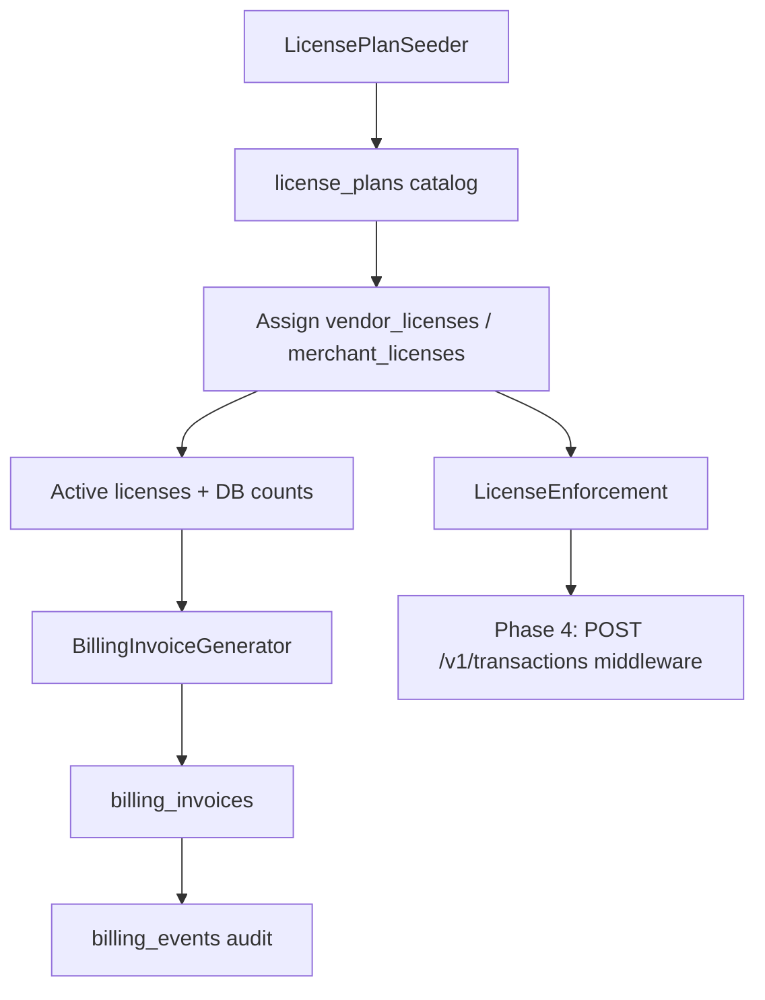

# Billing & Licensing — Phase 3 Foundation

> **Status:** Foundation module (schema, services, admin API, minimal UI).  
> **Backend:** Laravel 13 (`api/`). **Admin UI:** React (`api/resources/js/admin/`).

This module is separate from EIS **`invoices`** (POS transaction records). All billing records use the **`billing_invoices`** table.

---

## Plan types

| Slug | Name | Billing model | Unit | Default amount (PHP) |
|------|------|---------------|------|----------------------|
| `vendor_one_time` | Vendor One-Time License | one_time | vendor | 50,000.00 |
| `vendor_per_merchant` | Vendor Per-Merchant Activation | per_unit | merchant | 2,500.00 |
| `vendor_monthly_hosting` | Vendor Monthly Hosting | recurring_monthly | vendor | 15,000.00 |
| `merchant_one_time` | Merchant One-Time License | one_time | merchant | 10,000.00 |
| `merchant_per_branch_monthly` | Merchant Per-Branch Monthly | recurring_monthly | branch | 500.00 |
| `saas_per_merchant_monthly` | SaaS Per Merchant Monthly | recurring_monthly | merchant | 999.00 |
| `saas_per_branch_monthly` | SaaS Per Branch Monthly | recurring_monthly | branch | 199.00 |

Seed with:

```bash
php artisan db:seed --class=LicensePlanSeeder
```

---

## Database schema

| Table | Purpose |
|-------|---------|
| `license_plans` | Catalog of plan types |
| `vendor_licenses` | Licenses assigned to vendors |
| `merchant_licenses` | Licenses assigned to merchants |
| `billing_invoices` | Polymorphic billing records (vendor or merchant) |
| `billing_events` | Audit trail (activation, suspension, invoice issued) |

Migration: `database/migrations/0001_01_01_000010_create_billing_licensing_tables.php`

---

## Billing flow



**Monthly generation logic:**

1. **Vendor invoices** — `vendor_monthly_hosting` (flat) + `vendor_per_merchant` (× merchant count) + SaaS charges for that vendor's merchants/branches.
2. **Merchant invoices** — `merchant_per_branch_monthly` (× branch count).
3. SaaS rates come from the plan catalog and apply to live merchant/branch counts.

---

## Services (`App\Services\Billing\`)

| Service | Responsibility |
|---------|----------------|
| `LicensePlanCatalog` | List/find plans by category or slug |
| `VendorLicenseService` | Assign, activate, suspend; calculate monthly hosting |
| `MerchantLicenseService` | Assign, activate, suspend; per-branch monthly fees |
| `SaasBillingService` | Monthly SaaS total from merchant/branch counts |
| `BillingInvoiceGenerator` | Generate monthly `billing_invoices` |
| `LicenseEnforcement` | `canVendorOperate` / `canMerchantOperate` — hook for Phase 4 |
| `BillingEventLogger` | Writes `billing_events` |

---

## Admin API

Base path: `/admin` (Sanctum session). All routes require `auth:sanctum`.

| Method | Endpoint | Access |
|--------|----------|--------|
| GET | `/license-plans` | super_admin, vendor_admin, support |
| POST | `/license-plans` | super_admin only |
| GET | `/vendors/{vendor}/licenses` | scoped by role |
| POST | `/vendors/{vendor}/licenses` | super_admin, vendor_admin (own vendor) |
| GET | `/merchants/{merchant}/licenses` | scoped by role |
| POST | `/merchants/{merchant}/licenses` | super_admin, vendor_admin (own merchant) |
| GET | `/billing/summary` | all admin roles (vendor_admin scoped) |
| GET | `/billing/invoices` | all admin roles (vendor_admin scoped) |
| GET | `/billing/invoices/{id}` | scoped by billable |
| POST | `/billing/generate` | super_admin only |

### Example: assign vendor license

```http
POST /admin/vendors/1/licenses
Content-Type: application/json

{
  "plan_slug": "vendor_monthly_hosting",
  "quantity": 1
}
```

### Example: billing summary

```json
{
  "mrr": 4191.0,
  "currency": "PHP",
  "active_vendor_licenses": 2,
  "active_merchant_licenses": 1,
  "overdue_invoices": 0,
  "saas": {
    "merchant_count": 3,
    "branch_count": 6,
    "total": 4191.0
  }
}
```

---

## Enforcement hooks (Phase 4)

`LicenseEnforcement` is the integration point for transaction gating:

```php
// Future middleware on POST /v1/transactions
app(LicenseEnforcement::class)->assertVendorCanTransact($vendor);
app(LicenseEnforcement::class)->assertMerchantCanTransact($merchant);
```

Current behavior: if no licenses are assigned, operations are allowed (permissive default until licenses are enforced platform-wide).

---

## Admin UI

| Route | Component |
|-------|-----------|
| `/admin/billing` | `BillingPage` (Summary + License Plans tabs) |
| Vendor detail | `VendorLicenses` section |
| Merchant detail | `MerchantLicenses` section |

---

## Testing

```bash
cd api
php artisan migrate
php artisan test --filter=SaasBillingServiceTest
```

Unit test verifies SaaS monthly total for 3 merchants and 6 branches: `(3 × 999) + (6 × 199) = 4191 PHP`.

---

## Deferred

- Payment gateway integration and `paid_at` automation
- Email dunning for overdue `billing_invoices`
- License expiry cron and auto-suspension
- Middleware enforcement on `/v1/transactions` (Phase 4)
- Full billing invoice list UI and assign-license forms in admin
- Proration, discounts, and multi-currency support

---

*Document version: 1.0 — 2026-06-08*
