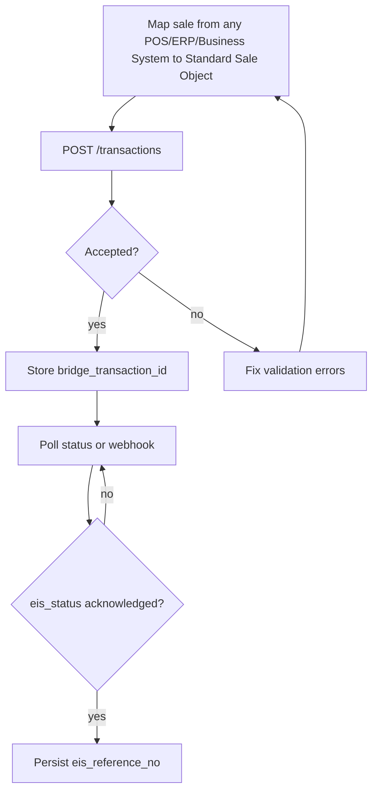

# EIS Bridge Certification Playbook

End-to-end guide for POS/ERP/Business System vendors and merchants moving from sandbox integration to live BIR EIS transmission. EIS Bridge handles technical mapping, signing, and submission; **each merchant taxpayer** still completes BIR registration, EIS CERT, and Permit to Transmit (PTT) on [eis-cert.bir.gov.ph](https://eis-cert.bir.gov.ph/).

---

## Who does what

| Party | Responsibility |
|-------|----------------|
| **POS/ERP/Business System vendor** | Map sales from any POS/ERP/Business System to the Standard Sale Object, integrate the Vendor API, pass the QA certification suite |
| **Merchant (taxpayer)** | EIS registration, EIS CERT application, PTT issuance, valid digital certificate |
| **EIS Bridge** | Merchant onboarding in the console, JSON mapping, JWS signing, queued transmission, status and audit logs |

BIR certifies **taxpayer systems** (middleware plus invoicing system), not software providers. EIS Bridge is not affiliated with or accredited by the BIR.

---

## Phase 1 — Vendor integration (sandbox)

1. **Register as a POS/ERP/Business System vendor** — contact [support@eisbridge.ph](mailto:support@eisbridge.ph) for Vendor Edition onboarding and sandbox credentials.
2. **Implement the Standard Sale Object** — see [POS Developer Integration Guide](pos-developer-integration-guide.md) and [sale-object.schema.json](schemas/sale-object.schema.json).
3. **Integrate async submission** — `POST /transactions` returns `processing_status: queued` immediately; poll status or use webhooks for BIR acknowledgment.
4. **Run QA Suite v1.0** — all test cases in [integration-test-cases-v1.md](qa/integration-test-cases-v1.md) against the sandbox environment.
5. **Vendor certification sign-off** — EIS Bridge reviews test evidence and approves production API key issuance.

### Sandbox environment

| Setting | Value |
|---------|-------|
| Base URL | `https://sandbox.eisbridge.com/v1` |
| Availability | Sandbox access is provisioned on request during vendor onboarding |
| Local alternative | Run the Laravel API locally (`api/` directory) with `EIS_SANDBOX_MODE=true` |

---

## Phase 2 — Merchant EIS CERT and PTT

Each merchant on your platform must complete BIR taxpayer-side requirements before live transmission.

### Step 1 — EIS registration

- Register the merchant on the BIR EIS portal per current Revenue Regulations.
- Confirm the merchant's TIN, business name, and branch structure match EIS Bridge onboarding records.

### Step 2 — EIS CERT (system certification)

Apply for EIS CERT on [eis-cert.bir.gov.ph](https://eis-cert.bir.gov.ph/) covering:

- The merchant's POS/ERP/Business System or invoicing system
- EIS Bridge as the transmission middleware (as configured in your integration)

**Document pack checklist** (prepare before submission):

| Document | Notes |
|----------|-------|
| System architecture diagram | POS/ERP/Business System → EIS Bridge → BIR EIS data flow |
| Standard Sale Object sample | Representative sale JSON from the merchant's POS/ERP/Business System |
| BIR EIS mapped JSON sample | Output after EIS Bridge mapping (available from sandbox signing tests) |
| Digital certificate details | Merchant's BIR-issued or approved signing certificate |
| Branch and device inventory | Branch codes, POS device IDs aligned with EIS Bridge console |
| Test transmission logs | Sandbox acknowledgments from QA suite or UAT |

EIS Bridge readiness checks (signing test, mapping test) in the admin console produce evidence suitable for CERT supporting documents.

### Step 3 — Permit to Transmit (PTT)

After EIS CERT approval:

1. Apply for PTT with the certified system configuration.
2. Record the PTT number and validity dates in the EIS Bridge admin console (`POST /admin/ptts` or merchant PTT screen).
3. Upload the merchant's signing certificate in the console.

### Step 4 — Readiness check

Open **Merchants → Readiness** in the EIS Bridge admin console. All checks must pass:

```json
{
  "ready": true,
  "checks": {
    "merchant_info": true,
    "branches": true,
    "devices": true,
    "certificate": true,
    "ptt": true,
    "signing_test": true,
    "mapping_test": true
  }
}
```

See [merchant-onboarding.md](merchant-onboarding.md) for the admin API and UI walkthrough.

---

## Phase 3 — Production go-live

1. Switch vendor integration to production base URL: `https://api.eisbridge.com/v1`.
2. Use production API key (issued after vendor certification).
3. Configure production webhook URL (`POST /vendors/webhook`).
4. Enable merchant licenses per your Vendor Edition agreement.
5. Monitor first live transmissions via admin dashboard and `GET /transactions/{bridge_transaction_id}`.
6. Persist `eis_reference_no` on acknowledged transactions for audit and customer receipts.

---

## Sandbox testing flow (quick reference)



**Key test scenarios** (from QA Suite v1.0):

- Single transaction submit (TC-01)
- Required field validation (TC-10 through TC-15)
- Duplicate / idempotency (TC-40)
- Batch submit (TC-50)
- Webhook delivery (TC-60)
- Offline / T+3 delayed transmission (TC-72)

---

## Vendor certification checklist

Before production API key issuance:

- [ ] Standard Sale Object mapping implemented and validated against JSON schema
- [ ] Single and batch submit working
- [ ] Status polling and/or webhooks implemented
- [ ] Duplicate handling tested (`status: duplicate` treated as success)
- [ ] Error handling for 400, 401, 403, 409 verified
- [ ] QA Suite v1.0 executed with documented results
- [ ] At least one test merchant onboarded with branches and devices
- [ ] Production webhook endpoint reachable over HTTPS

---

## Merchant go-live checklist

Before enabling live transmission for a merchant:

- [ ] EIS registration complete
- [ ] EIS CERT approved for configured system
- [ ] PTT issued and recorded in EIS Bridge console
- [ ] Signing certificate uploaded and valid
- [ ] Readiness check passes (all seven checks green)
- [ ] Merchant license active (Vendor Edition)

---

## Support and escalation

| Need | Contact |
|------|---------|
| Vendor onboarding, sandbox access | [support@eisbridge.ph](mailto:support@eisbridge.ph) |
| CERT/PTT document guidance | EIS Bridge onboarding team (technical pack only — not tax or legal advice) |
| Integration issues | [POS Developer Integration Guide](pos-developer-integration-guide.md), [Vendor API](vendor-api.md) |

---

© 2026 EIS Bridge
