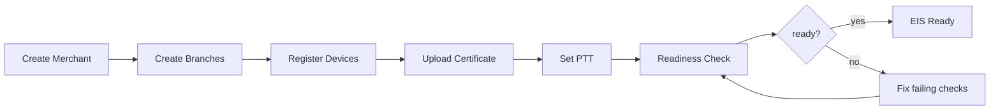

# Merchant Onboarding Flow (Phase 3)

Phase 3 implements a six-step merchant onboarding pipeline in the EIS Bridge admin console. Each step maps to a dedicated UI screen and admin API endpoint.

## Flow diagram



## Admin API endpoints

| Step | Method | Endpoint | Key fields |
|------|--------|----------|------------|
| 1 | POST | `/api/admin/merchants` | `name`, `tin`, `address`, `vendor_id`, `status` |
| 2 | POST | `/api/admin/branches` | `branch_code`, `name`, `address`, `status`, `merchant_id` |
| 3 | POST | `/api/admin/devices` | `pos_device_id`, `status`, `branch_id` |
| 4 | POST | `/api/admin/certificates` | `merchant_id`, `file`, `password` |
| 4 (alias) | POST | `/api/admin/merchants/{id}/certificate` | `file`, `password` |
| 5 | POST | `/api/admin/ptts` | `ptt_number`, `valid_from`, `valid_to`, `merchant_id` |
| 5 (alias) | PUT | `/api/admin/merchants/{id}/ptt` | `ptt_number`, `valid_from`, `valid_to` |
| 6 | GET | `/api/admin/merchants/{id}/readiness` | — |

## Readiness response

```json
{
  "merchant": "ABC Store",
  "ready": true,
  "checks": {
    "merchant_info": true,
    "branches": true,
    "devices": true,
    "certificate": true,
    "ptt": true,
    "signing_test": true,
    "mapping_test": true
  }
}
```

`ready` is `true` only when every check passes. Signing and mapping tests run against sample payloads using the merchant's certificate, branch, and device data.

## Admin UI routes

| Step | Route |
|------|-------|
| Merchant list | `/admin/merchants` |
| Create merchant | `/admin/merchants/create` |
| Merchant hub | `/admin/merchants/:id` |
| Branches | `/admin/merchants/:id/branches` |
| Devices | `/admin/merchants/:id/devices` |
| Certificate | `/admin/merchants/:id/certificate` |
| PTT | `/admin/merchants/:id/ptt` |
| Readiness | `/admin/merchants/:id/readiness` |

## Constraints

- `branch_code` is unique per merchant.
- `pos_device_id` is unique per branch.
- Devices with `status=locked` cannot submit transactions (`TransactionProcessor` returns HTTP 403).
- Vendor admins are scoped to merchants belonging to their vendor (policies + `AdminScope`).
- Certificate uploads are validated for structure; expiry is extracted automatically when possible.

## Manual walkthrough

1. Sign in at `/admin/login` (seed: `super_admin@eis-bridge.test` / `password`).
2. Go to **Merchants** → **Create Merchant**.
3. Complete step 1, then continue through branches, devices, certificate, and PTT.
4. Open **Readiness** to run signing and mapping validation.
5. When all checks pass, the merchant is EIS-ready for live transmission.

Set `PHASE1_MOCK = false` in `resources/js/admin/config/phase1.js` to wire the readiness screen to the live API.
