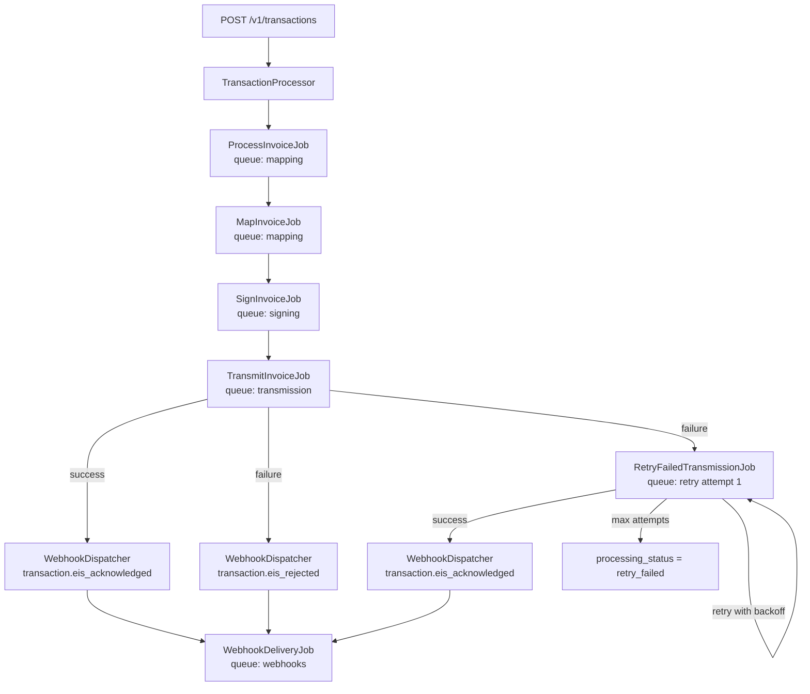

# Phase 2 Engine — POS to BIR EIS Pipeline

This document describes the Phase 2 invoice processing engine as implemented in the Laravel `api/` application. It maps the user's skeleton architecture to actual file paths, queue names, and status transitions.

## Overview

When a POS vendor submits a transaction via `POST /v1/transactions`, the bridge accepts the payload, persists an `invoices` row, and dispatches an asynchronous job chain:



## Entry point

| Component | Path |
|-----------|------|
| HTTP controller | `api/app/Http/Controllers/TransactionController.php` |
| Orchestrator | `api/app/Services/TransactionProcessor.php` |

After creating an invoice with `processing_status = queued`, the processor dispatches:

```php
ProcessInvoiceJob::dispatch($invoice->id)->onQueue('mapping');
```

## Mapping

| Skeleton | Implementation |
|----------|----------------|
| `PosToBirMapper::map(array $pos)` | `api/app/Services/Mapping/PosToBirMapper.php` |
| Sub-mappers | `ItemMapper`, `TotalsMapper`, `CustomerMapper` in `api/app/Services/Mapping/` |
| Schema validation | `api/app/Services/Mapping/BirSchemaValidator.php` |
| JSON Schema file | `docs/schemas/bir-eis-invoice.schema.json` |

### Skeleton field mapping

The skeleton uses shorthand names; the BIR schema uses nested, schema-valid keys:

| Skeleton field | BIR output field |
|----------------|------------------|
| `invoiceNumber` | `transaction_id` |
| `invoiceDateTime` | `transaction_datetime` |
| `merchantCode` | `merchant.code` |
| `branchCode` | `branch.code` |
| `posId` | `device.pos_device_id` |
| `items` | `line_items` (via `ItemMapper`) |
| `totals` | `totals` (via `TotalsMapper`) |
| `payment` | `payment` |

`PosToBirMapper` also enriches merchant/branch/device from the database and adds `eis_fields`, `customer`, `ptt`, and `references` when present.

## Signing

| Skeleton | Implementation |
|----------|----------------|
| `CertificateLoader::loadForMerchant(int $merchantId)` | `api/app/Services/Signing/CertificateLoader.php` — returns `['path' => ..., 'password' => ...]` |
| Certificate model | `MerchantCertificate` on `merchant_certificates` table |
| Path resolution | `api/app/Services/Certificate/CertificateStorageService.php` |
| `JsonSigner::sign(array $payload, string $pfxPath, string $password)` | `api/app/Services/Signing/JsonSigner.php` — RS256 via `openssl_sign`, returns `payload`, `signature`, `signature_hash`, `algorithm` |

When `EIS_SANDBOX_MODE=true` and no merchant certificate exists, `SignInvoiceJob` falls back to `JsonSigner::sandboxSign()` (algorithm `SANDBOX`).

Merchant lookup uses `Merchant::where('merchant_code', $invoice->merchant_code)`.

## EIS transmission

| Skeleton | Implementation |
|----------|----------------|
| Config | `api/config/eis.php` — `endpoint`, `timeout`, `sandbox_mode`, `mtls`, `retry_max_attempts`, `retry_backoff` |
| Client | `api/app/Services/Eis/EisClient.php` |
| Response parser | `api/app/Services/Eis/EisResponseParser.php` |

`EisClient::send(array $signedPayload, Invoice $invoice)`:

- **Sandbox** (`EIS_SANDBOX_MODE=true`): simulates acknowledgement, writes `transmission_logs` with `event = sent_to_eis`.
- **Production** (`EIS_SANDBOX_MODE=false`): HTTP POST to `EIS_ENDPOINT`, optional mTLS, logs outbound payload/response in `metadata`.

Transmission logs use columns `invoice_id`, `event`, `timestamp`, `metadata` (not separate direction/endpoint columns — those live inside `metadata`).

### Retry policy

| Setting | Config key | Default |
|---------|------------|---------|
| Max retry attempts | `eis.retry_max_attempts` | `5` |
| Backoff schedule (seconds) | `eis.retry_backoff` | `[60, 300, 900, 3600, 7200]` |
| Per-vendor override | `vendors.eis_retry_max_attempts` | `null` (uses global) |

`RetryFailedTransmissionJob::calculateBackoff(int $attempt)` selects the delay for the next retry. On exhaustion, the invoice is marked `retry_failed` with `eis_status = failed`.

## Webhooks

After EIS responds (success or first failure), the bridge notifies the vendor's configured endpoint.

| Component | Path |
|-----------|------|
| Dispatcher | `api/app/Services/Webhooks/WebhookDispatcher.php` |
| Delivery job | `api/app/Jobs/WebhookDeliveryJob.php` |
| Delivery log | `webhook_deliveries` table / `WebhookDelivery` model |

### Vendor resolution

Vendor is resolved via the merchant relationship — **never** by matching `merchant_code` on the `vendors` table:

```
invoice.merchant_code → merchants.merchant_code → merchants.vendor_id → vendors
```

### Events

| Event | When fired |
|-------|------------|
| `transaction.eis_acknowledged` | EIS accepts the invoice (`TransmitInvoiceJob` or successful retry) |
| `transaction.eis_rejected` | Initial transmission fails (`TransmitInvoiceJob`) |
| `webhook.test` | Admin test webhook (optional) |

### Payload shape

```json
{
  "event": "transaction.eis_acknowledged",
  "data": {
    "bridge_transaction_id": "EB-000001",
    "transaction_id": "POS-001",
    "eis_status": "acknowledged",
    "eis_reference_no": "EIS-INV-20260608-ABC123"
  }
}
```

### Delivery & security

- Queue: `webhooks`
- HMAC-SHA256 signature in header `X-EISBridge-Signature` (body signed with `vendor.webhook_secret`)
- Each attempt logged to `webhook_deliveries` (`vendor_id`, `invoice_id`, `event`, `request_url`, `attempt`, `status_code`, `response_body`, `success`)
- Up to 5 delivery attempts with backoff `30 × attempt` seconds (30, 60, 90, 120)

## Jobs

All jobs implement `ShouldQueue` and use `Dispatchable`, `InteractsWithQueue`, `Queueable`, `SerializesModels`.

| Job | Queue | File | Responsibility |
|-----|-------|------|----------------|
| `ProcessInvoiceJob` | `mapping` | `api/app/Jobs/ProcessInvoiceJob.php` | Dispatches `MapInvoiceJob` |
| `MapInvoiceJob` | `mapping` | `api/app/Jobs/MapInvoiceJob.php` | Map POS → BIR, validate schema, set `bir_json`, status `mapped` → dispatch `SignInvoiceJob` |
| `SignInvoiceJob` | `signing` | `api/app/Jobs/SignInvoiceJob.php` | Load cert, sign, set `signed_json`, status `signed` → dispatch `TransmitInvoiceJob` |
| `TransmitInvoiceJob` | `transmission` | `api/app/Jobs/TransmitInvoiceJob.php` | EIS send; on success → `sent` + webhook acknowledged; on failure → `transmission_failed` + webhook rejected + dispatch retry |
| `RetryFailedTransmissionJob` | `retry` | `api/app/Jobs/RetryFailedTransmissionJob.php` | Backoff retries via `EisClient`; success → `sent` + webhook; exhaustion → `retry_failed` |
| `WebhookDeliveryJob` | `webhooks` | `api/app/Jobs/WebhookDeliveryJob.php` | POST signed payload to vendor webhook URL |

## Processing status transitions

```
queued → mapping → mapped → signing → signed → transmitting → sent
                     ↘ failed ↙ (validation or signing errors)
transmitting → transmission_failed → (retry) → sent | retry_failed
```

| Status | Set by |
|--------|--------|
| `queued` | `TransactionProcessor` on create |
| `mapping` | `MapInvoiceJob` start |
| `mapped` | `MapInvoiceJob` success |
| `signing` | `SignInvoiceJob` start |
| `signed` | `SignInvoiceJob` success |
| `transmitting` | `TransmitInvoiceJob` start |
| `sent` | `TransmitInvoiceJob` or `RetryFailedTransmissionJob` success |
| `transmission_failed` | `TransmitInvoiceJob` EIS failure |
| `retry_failed` | `RetryFailedTransmissionJob` after max attempts |
| `failed` | Mapping/signing unrecoverable errors |

## Queue configuration

Final queue order: **mapping → signing → transmission → retry → webhooks**

### Local / Windows development (database driver)

In `.env`:

```env
QUEUE_CONNECTION=database
EIS_SANDBOX_MODE=true
```

Run workers (one process per queue or combined):

```bash
php artisan queue:work database --queue=mapping,signing,transmission,retry,webhooks
```

Ensure the `jobs` table exists (`php artisan migrate`).

### Production (Redis + Horizon)

In `.env`:

```env
QUEUE_CONNECTION=redis
REDIS_HOST=127.0.0.1
REDIS_PORT=6379
EIS_SANDBOX_MODE=false
EIS_ENDPOINT=https://your-production-eis-endpoint
```

Horizon supervises all Phase 2 queues — see `api/config/horizon.php` (`mapping`, `signing`, `transmission`, `retry`, `webhooks`).

```bash
php artisan horizon
```

Supervisor fallback (non-Horizon): `deploy/supervisor/eis-bridge-queues.conf`.

## Manual pipeline test

1. Seed merchant, branch, device, and optionally upload a certificate via admin.
2. Configure vendor webhook URL and secret in admin (optional, for webhook verification).
3. Set `EIS_SANDBOX_MODE=true` in `.env`.
4. Start queue worker: `php artisan queue:work database --queue=mapping,signing,transmission,retry,webhooks`
5. POST a transaction:

```bash
curl -X POST http://localhost/v1/transactions \
  -H "X-API-Key: YOUR_VENDOR_KEY" \
  -H "Content-Type: application/json" \
  -d @sample-pos-transaction.json
```

6. Inspect invoice: `processing_status`, `bir_json`, `signed_json`, `eis_status`, `eis_reference_no`.
7. Inspect logs: `transmission_logs` for events `queued`, `mapped`, `signed`, `sent_to_eis`.
8. If webhook configured: inspect `webhook_deliveries` for `transaction.eis_acknowledged`.

### Manual retry / failure test

1. Set `EIS_SANDBOX_MODE=false` and point `EIS_ENDPOINT` at an unreachable host, **or** mock `EisClient` in tinker.
2. Submit a transaction with a signed invoice already in the DB.
3. Confirm `processing_status = transmission_failed`, webhook `transaction.eis_rejected` logged.
4. Confirm `RetryFailedTransmissionJob` entries appear on the `retry` queue with increasing delays.
5. After max attempts, confirm `processing_status = retry_failed`.

Or run the signing CLI against a merchant:

```bash
php artisan eis:test-signing {merchant_id}
```

## Tests

| Test | Path |
|------|------|
| Mapper + schema | `api/tests/Unit/PosToBirMapperTest.php`, `BirSchemaValidatorTest.php` |
| Signing job | `api/tests/Unit/SignInvoiceJobTest.php` |
| Transmission + retry dispatch | `api/tests/Unit/TransmitInvoiceJobTest.php` |
| Retry backoff + exhaustion | `api/tests/Unit/RetryFailedTransmissionJobTest.php` |
| Webhook dispatch + vendor lookup | `api/tests/Unit/WebhookDispatcherTest.php` |
| Webhook HMAC + delivery log | `api/tests/Unit/WebhookDeliveryJobTest.php` |
| Full pipeline | `api/tests/Feature/Phase2EngineTest.php` |

```bash
cd api && php artisan test
```
